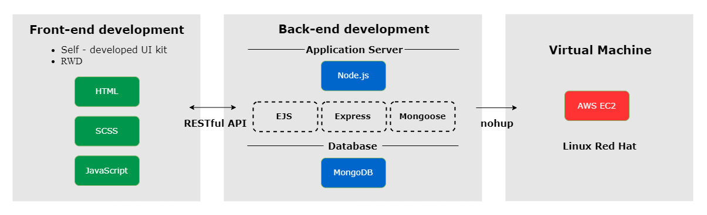
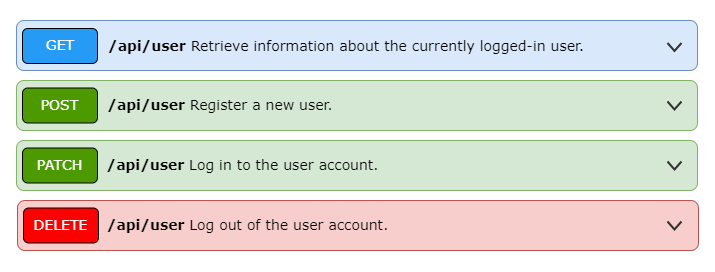
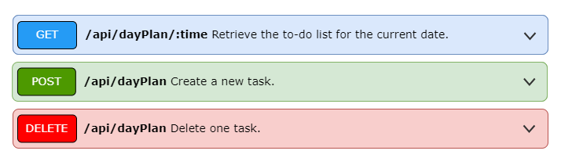
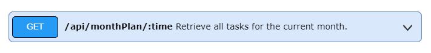

# Readme

# **My Day 我的一天**

---

“My Day” is a website for planning schedules. Featuring a “Member Login System,” each member can click on a specific day on the calendar to add schedules for that day.

“我的一天”是一個規劃行程網站。具有"會員登入系統"的功能，每位會員可以點擊月曆上的某一天以新增當天的行程。

## **Live Demo**

---

The website link is as follows:

[**http://13.230.97.188:3000/**](http://13.230.97.188:3000/)

### **Test Account**

| Account | dog@zoo.com | cat@zoo.com |
| --- | --- | --- |
| Password | 654321 | 123456 |

## **Skills Structure**

---

- **Front-end development**
    
    The programming languages used in front-end development include HTML, CSS, and JavaScript, which are used to structure and design the visual elements that interact with users.
    
    前端開發所使用的程式語言有 HTML、CSS 和 JavaScript ，用來結構且設計與用戶互動的視覺元素。
    
- **Back-end development**
    
    Connecting to MongoDB through Mongoose to facilitate database access, and utilizing EJS as the template engine along with the Node.js web framework Express, achieve client-side rendering and execute server-side operations.
    
    透過 Mongoose 連接上 MongoDB 以提供數據庫存取，並使用 ejs 作為模板引擎與 Node.js 的 Web 框架 Express，實現客戶端渲染並執行伺服器。
    
- **Virtual Machine**
    
    Using AWS EC2 to set up a cloud server and deploy the code to the virtual machine.
    
    使用AWS的EC2去建立雲端伺服器，並將程式碼部署到虛擬主機。
    

## **RESTful API**

---

### User

### To-do list

### Current month's scheduled itinerary

"My Day" adopts a front-end and back-end separation development approach, utilizing RESTful APIs to retrieve different data from the backend based on the request methods sent by the frontend.

“我的一天” 採用前後端分離的開發方式，利用RESTful API，根據前端發送的請求方法從後端取得不同的資料。